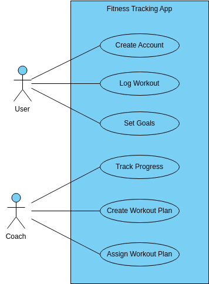

### Descrição:
Aplicativo de fichas de treino de academia com customização de diferentes academias.

### Necessidade observada:
Alguns usuários de academia precisam de um app que customize os treinos de musculação de acordo com cada academia que utiliza. A cargas anotadas no aplicativo que utilizo atualmente, são pesos que anoto na primeira academia utilizada sempre que recebo uma nova sequência de treino do meu personal trainer, este fato causa um tanto desconforto sempre que mudo de academia, pois exige que eu memorize ou teste, a cada exercício, qual a carga ideal para o equipamento, perdendo tempo e desempenho no treino. Além disso, o aplicativo não permite que meu personal visualize o andamento das minhas atividades, meus treinos realizados e minha evolução no aumento de carga dos exercícios. Seria interessante que ao iniciar o treino do dia, o aplicativo pergunte qual academia da "listagem de academias do cliente" ele deseja treinar naquele dia ou ofereça a opção de anotar as cargas do treino em uma nova academia.

### Publico Alvo:
Pessoas que como eu que tenham a necessidade de treinar em mais de uma academia, ou seja, que permutam frequentemente entre academias diferentes ao longo dos dias e precisam anotar as cargas, repetições e equipamentos de acordo com cada academia em específico, pois não há um padrão universal de pesos e medidas nem de equipamentos entre todas as academias, que na maioria das vezes nem da mesma marca são. Especialmente pensado para clientes com passe corporativo Wellhub (antigo Gympass), que se deslocam a negócios entre cidades com frequência.

